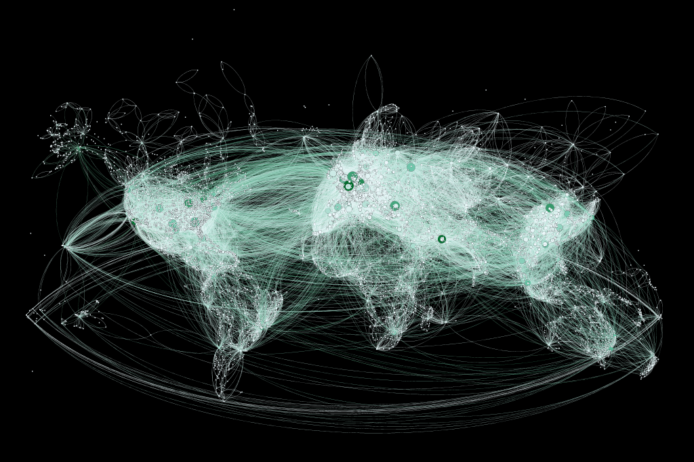

# Global Cities

## Mapping Air Connections

Inspired by global cities network as depicted in "Global Cities: a, ß and ? tiers" map (Carta & González 2010), in this project, we set out to visualise air connectivity to illustrate the interconnectedness element which characterises global cities.

### Data Source

Using data from open source: openflights.org (https://openflights.org/data.html), we extracted two datasets through Excel: airports.csv,and routes.csv. This database consists of over 7000 airports, and 655536 flight records. 

### Method

We used Stata to eliminate missing observations and duplicates locations in nodes if required, in which the number reduced to only 5000.

In preparation for visualization in Gephi, we divided the data into two files: nodes, which contains airport coordinates, and linkages, which has source and target airport. 

We set longitude and latitude in double format, then proceeded to apply Geolayout and set different colors to encapsulate distinctive elements. We then modify the nodes depending on degree centrality, which means how well-connected with other cities, and rank the link in accordance with airline frequency. 

### Discussion

The graph connotes two implications. First, European airports tend to have higher connectivity in comparison with other continents’ counterparts. Second, there are high air connectivity between US and Europe, as well as China and Europe.

### Acknowledgement

Special credits go to Young Joon Oh with his tutorial video.
https://www.youtube.com/watch?v=DvSJQRx9Jss&list=LLqsMN_VaDEEWWB18BrZv5vw&index=4&t=747s

***References

Carta, S. and Gonzalez, M., 2013. Mapping Connectedness of Global Cities: a, ß and ? tiers.

